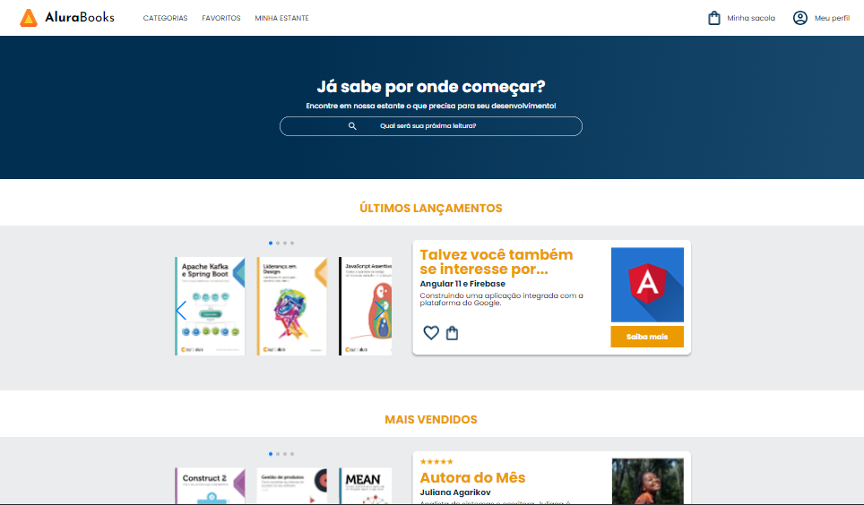

# AluraBooks

Seja bem vindo ao AluraBooks!

Nele há vários livros sobre tecnologia em diversas áreas diferentes! Venha descobrir mais!

## Ferramentas utilizadas:

* HTML

* CSS

* Flexbox

### Totalmente responsivo:

## Feito por:

### Maria Luíza, com o auxílio da professora Mônica Mazzochi no [curso](https://cursos.alura.com.br/course/html-css-responsividade-mobile-first) da Alura

### Linkedin: https://www.linkedin.com/in/lizmariasena/
